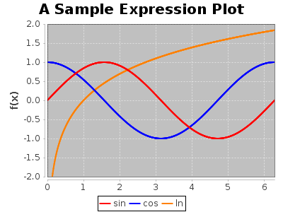
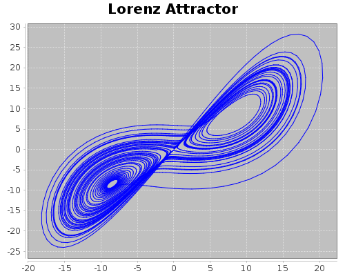

# The Aya Programming Language


## Features

  - Terse, yet readable syntax
  - Standard library written in aya code
  - Key-value pair dictionaries and objects
  - Number types: double, arbitrary precision float, rational, *complex (coming soon)*
  - Basic support for objects and data structures using metatables
  - Pre-evaluation stack manipulation (custom infix operators)
  - List comprehension
  - String Interpolation, Unicode, and special characters
  - Interactive GUI
  - Built in plotting
  - Interactive help and Documentation
  - Simple GUI dialogs

## Overview

Aya is a terse stack based programming language originally intended for code golf and programming puzzles. The original design was heavily inspired by [CJam](https://sourceforge.net/p/cjam/wiki/Home/) and [GolfScript](http://www.golfscript.com/golfscript/). Currently, Aya is much more than a golfing language as it supports user-defined types, key-value pair dictionaries, natural variable scoping rules, and many other things which allow for more complex programs and data structures than other stack based languages.

Aya comes with a standard library written entirely in Aya code. The standard library features types such as matrices, sets, dates, colors and more. It also features hundreds of functions for working working on numerical computations, strings, plotting and file I/O. It even features a basic turtle library for creating drawings in the plot window.

Aya also features a minimal GUI that interfaces with Aya's stdin and stdout. The GUI features plotting, tab-completion for special characters, and an interactive way to search QuickSearch help data.

## Useful Links

  - [A Tour of Aya](https://github.com/nick-paul/aya-lang/wiki/A-Tour-of-Aya)
  - [Documentation / Wiki](https://github.com/nick-paul/aya-lang/wiki)
  - [Examples](https://github.com/nick-paul/aya-lang/tree/master/examples)
  - [Esolang Wiki](http://esolangs.org/wiki/Aya)

## Installation

Download the latest release from the release page ([https://github.com/nick-paul/aya-lang/releases](https://github.com/nick-paul/aya-lang/releases)) and unpack the archive. 

Aya requires Java 8. To run the GUI, double click the jar file or run the command:

```
java -jar aya.jar
```

To run Aya interactively from the command line use `-i`

```
java -jar aya.jar -i
```

To run scripts from the command line:

```
java -jar aya.jar filename.aya
```

## Examples

### Project Euler Problem 1

*Find the sum of all the multiples of 3 or 5 below 1000.*

```
aya> :1e3VR{15.+!}IS
233168
```
Note that `V`, `R`, `I`, and `S` (and all other uppercase letters) are operators just like `+`, `-`, `*`, `/`, etc.

```
aya> 0:sum;
     999R # {x,
       x5%0= x3%0= | {x sum +:sum} ?
     };
     sum
233168
```

### Recursive factorial function written in the style of C.

The tick (\`) operator is used to convert postfix operators into infix ones.

```
`:factorial {n,
  n `:< 1 {
    1
  } {
    n `* ( `factorial(n`-1) )
  } .?
}
```

### Define a 2D vector type

Type definition:

```
{,

  .# Constructor
  {x y, {, x:x y:y} vec MO}:new;

  .# Print Override
  {self, "<$(self.x),$(self.y)>"}:repr;

  .# Member Function
  {self, self.x2^ self.y2^ + Mq}:len;

  .# Operator Overload
  {a b, a.x b.x+ a.y b.y+ vec!}:add

}:vec;

```

Call constructor using `!` operator and print using `.repr` definition:

```
aya> 3 4 vec! :v
<1,2>

```
Perform operations on the type:

```
aya> v.len
5.0

aya> 10 10 vec! v +
<13,14>
```

### Plot some expressions

```
import "plot color list math"

plot!:p;

.# The domain
0 2pi* 600 linspace p.domain

.# Add each function
"sin" 2 colors.red.rgb    {sin} p.addexpr
"cos" 2 colors.blue.rgb   {cos} p.addexpr
"ln"  2 colors.orange.rgb {ln} p.addexpr

.# Plot title
"A Sample Expression Plot" p.:title

.# Other plot parameters
[(-2) 2] p.:yaxis;
[0 2pi*] p.:xaxis;
1        p.:legend;
"f(x)"   p.:ylabel;
400      p.:width;
300      p.:height;

.# Open the plot window
p.view

.# Save the plot
"sample_plot.png" p.save
```

Output:



### Plot a Lorenz Attractor

```
import ::plot

.# Starting parameters
0.01 :x;
0.1  :y;
0.3  :z;
10   :a;
28   :b;
8`/3 :c;
0.01 :dt;

.# List to keep track of state
[]

{
  .# Update the point
  [
    y x - a * dt* x+:x
    b z - x * y - dt* y+:y
  ]
  x y * c z * - dt* z+:z;

  .# Append to state list
  \.B
} 5000 %

.# Transpose to separate list of x and y values
.T ~ plot.line:p

"Lorenz Attractor" p.:title;

p.view
```

Output:



### Interactive help

Add a `?` to a line comment operator `.#` to add the comment to the interactive help.
The interactive help can be searched from within the REPL or IDE and can be used
to document source files.

```
aya> .#? A help comment!\n  This comment will be added to the interactive help
aya> \? help comment
A help comment!
     This comment will be added to the interactive help
```

Sample documentation from `math.aya`

```
{Mp}:primes;        .#? N primes\n  returns a list containing the primes up to and including N
{{*}U}:product;     .#? L product\n  product of a list
{.!}:signnum;       .#? N signnum \n  returns the sign of a number (1,0,-1)
{Mq}:sqrt;          .#? N sqrt\n  square root
```


# TODO

  - *See issues page for more detailed todos*
  - **Optimization**: Parts of the interpreter run fairly slow and can be optimized to run faster. Many operators also need to be optimized.
  - **More Operators**: Most of the dot (`.<op>`), misc (`M<op>`), and colon (`:<op>`) operators have not yet been assigned.
  - **Refine the Standard Library**: Debug, fix small errors, clean
  - **Better I/O Support**: Currently IO includes text files (input and output) and the ability to download files from the web. An official IOStream object should be implemented.
  - Complex number types

## Contributing

If you find any bugs or have any feature or operator ideas, please submit an issue on the issue page. Alternively, implement any feature or bugfix yourself and submit a pull request. 

# Limitations

Aya was not originally intended for computational or memory intensive tasks. It was intended to be used as an advanced desktop "calculator" for programming puzzles and simple or tedious computational tasks. It's compact syntax and extensibility make it great for both of these. As the language grows it will become better for larger and larger tasks.
