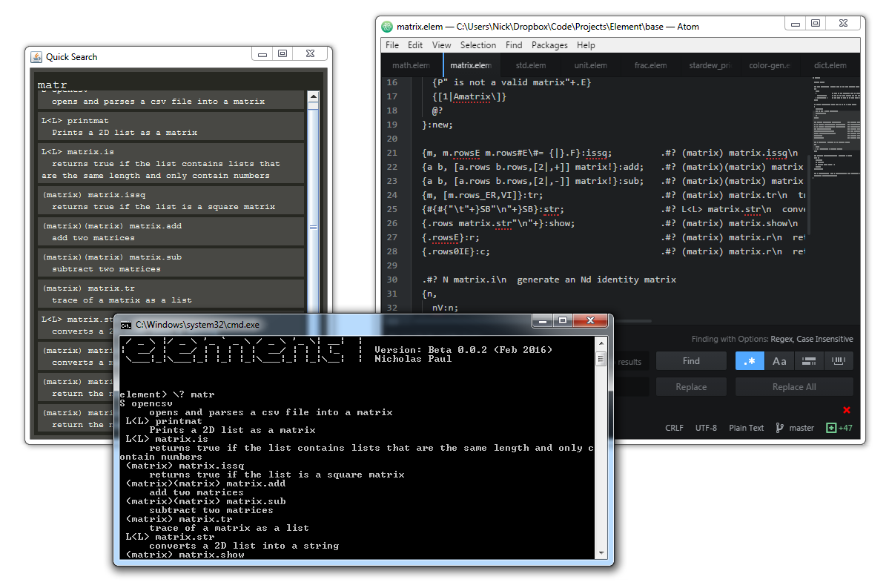
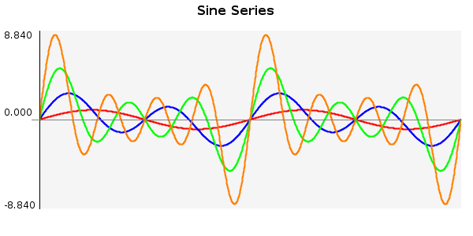

# The Element Programming Language



## Features

  - Terse, yet readable syntax
  - Fully loaded with a complete standard library
  - Modules with namespace like functionality
  - Basic support for objects and data structures
  - Macro-like pre-evaluation stack manipulation
  - Functional feel: List comprehension etc.
  - String Interpolation, Unicode, and special characters
  - Comes pre-packaged with a feature packed GUI
  - Built in plotting
  - Interactive help and Documentation
  - Colored printing and simple UI elements

## Overview

Element is a stack based programming language originally intended for code golf and programming puzzles. However, the language is very different from most golfing languages. Its support for user-defined types and macro-like function definitions allow for complex programs and data structures. It excels in cases were programs need to be written quickly.

Element comes fully-loaded with a standard library written entirely in element code. The standard library features types such as fractions, dictionaries, matrices, stacks, and more. It also features hundreds of functions for working working on numerical computations, strings, plotting and file I/O.

Element also features a minimal GUI for easily writing code and working using the element language. The GUI features colored console printing, plotting, tab-completion for special characters, and most importantly, an interactive way to search QuickSearch help data.

## Usage

Element requires Java 8. To run the GUI, run the command:

```
java -jar element.jar
```

To run element interactively from the command line use `-i`

```
java -jar element.jar -i
```

To run files from the command line, use `-f`

```
java -jar element.jar -f file.elem
```

## Examples

### Golfed Project Euler Problem 6

```
hR_S2^\2#^S-

Explanation:
hR            Generate a list [1,2..100]
  _           Duplicate the list
   S2^        Evaluate the sum of the list and square it
      \       Bring the other list to the top of the stack
       2#^    Square each element in the list
          S-  Subtract the sum of this list from the previous sum
```

### Recursive factorial function written in the style of C.

The tick (\`) operator is used to convert postfix operators into infix ones.

```
`:factorial {n,
  if (n `.< 1) {
    1
  } {
    n `* ( `factorial(n`-1) )
  }
}
```

### Define a 2D vector type

Type definition:

```
{@ vec,

  members "x y"

  .# Constructor
  {x y, [x y] vec MO}:new;

  .# Print Override
  {self, "<$(self.x),$(self.y)>"}:show;

  .# Member Function
  {self, self.x2^ self.y2^ + Mq}:length;

  .# Operator Overload
  {a b, [a.x b.x+ a.y b.y+] vec MO}:plus

}

```

Call constructor using `!` operator and print using `.show` definition:

```
element> 1 2 vec!
<1,2>

```
Perform operations on the type:

```
element> 3 4 vec! :v
<3,4>

element> v.length
5.0

element> 10 10 vec! v +
<13,14>
```

### Plot a sine series from 0 to 4pi using the built in plotting tool.

```
.# Series function
{n : cs f,
  .#Generate coefficients
  nR:cs;

  .#Series function
  {x, [cs [nR,x*Ms],*]S}:f;

  [0∆4π*,f]
}:sinsrs;

.# Create a plot instance
plot!:p;

.# Optional parameters
"Sine Series" p.settitle
300 p.setheight
600 p.setwidth

.# Add the lines
2 colors.red    (1 sinsrs) p.addcustomline
2 colors.blue   (2 sinsrs) p.addcustomline
2 colors.green  (3 sinsrs) p.addcustomline
2 colors.orange (4 sinsrs) p.addcustomline

.# Open the plot in a new window
p.view

.# Save the plot to a file
"plots/sinsrs" p.save
```

Output:



### Some Standard Library Types
Below are some examples of **matrices**, **fractions**, and **complex numbers**. All of these types are defined in element in the standard library.

```
element> [[1 2 3][4 5 6][7 8 9]]  matrix! :mat
|  1  2  3 |
|  4  5  6 |
|  7  8  9 |


element> mat 3 matrix.eye +
|  2  2   3 |
|  4  6   6 |
|  7  8  10 |

element> 3z7
3/7

element> 3z4 1.25 +
2/1

element> mat {z2} &
|  1/2  1/1  3/2 |
|  2/1  5/2  3/1 |
|  7/2  4/1  9/2 |


element> 3im4+ 2im +
4+5i

element> 6im7+ 2^
13+84i
```

# TODO

  - **Optimization**: Parts of the interpreter run fairly slow and can be optimized to run faster. Many operators also need to be optimized.
  - **More Operators**: Most of the dot (`.<op>`) and misc (`M<op>`) operators have not yet been assigned.
  - **Refine the Standard Library**: Debug, fix small errors, clean
  - **Better I/O Support**: Currently IO includes text files (input and output) and the ability to download files from the web. An official IOStream object should be implemented.
  - **Improved Plotting**: More parameters and customization
